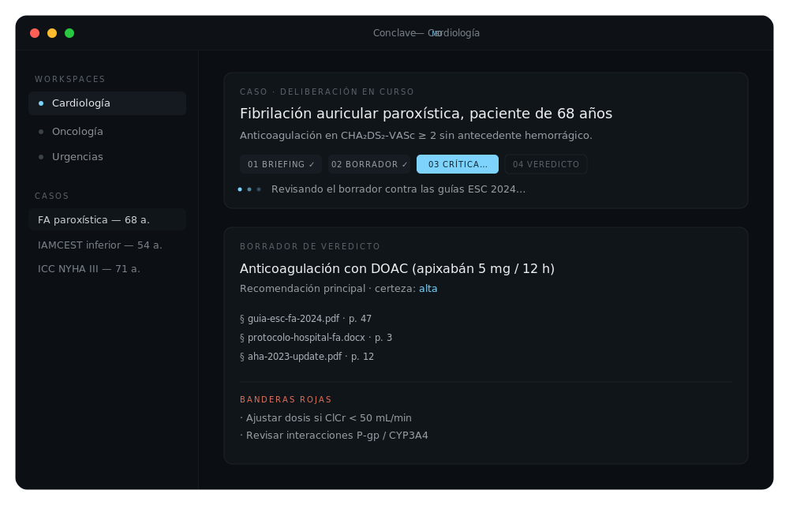

<div align="center">


<br>

**A local-first clinical decision-support desktop app — a virtual multidisciplinary committee that deliberates over _your_ protocols, on _your_ machine.**

<br>

[](https://github.com/XusBadia/conclave/releases)
[](#license)
[](#install)
[](#privacy-by-design)
[](https://github.com/XusBadia/conclave/stargazers)

[](#)
[](#)
[](#)
[](#)

[**Download**](https://github.com/XusBadia/conclave/releases/latest) ·
[Build from source](#build-from-source) ·
[How it works](#how-it-works) ·
[Privacy](#privacy-by-design)

</div>

---

Most AI tools hand you the first idea that comes to mind. **Conclave MD puts it on
trial.** It runs a four-phase deliberation — brief, draft, critique, verdict —
where the model argues *against itself* before committing to a recommendation,
grounded in the guidelines and protocols you feed it. Everything runs on your
machine: your documents are never sent to a Conclave server, because there is no
Conclave server.

## Preview

<div align="center">

</div>

## Why Conclave MD

- **Adversarial by design** — a draft is critiqued and revised before you ever
  see a verdict, surfacing the uncomfortable questions a single-shot answer skips.
- **Grounded in your protocols** — ingest PDFs, DOCX, HTML and scanned documents;
  every recommendation cites the exact source and page.
- **Local-first and private** — patient text is de-identified before any model
  call, secrets live in the OS keychain, and there is zero telemetry.
- **Bring your own engine** — Anthropic, OpenAI, OpenRouter, your Claude/ChatGPT
  subscription, or fully offline via Ollama and Apple Intelligence.
- **Auditable** — cases, verdicts and run history are persisted locally in SQLite
  so every conclusion can be traced back.

## How it works

Each case runs through a structured committee instead of a single prompt:

| Phase | What happens |
|------:|--------------|
| **1 · Brief** | The case is de-identified and framed against the relevant protocols retrieved from your knowledge base. |
| **2 · Draft** | The committee proposes an initial recommendation with citations. |
| **3 · Critique** | The draft is challenged — missing data, contraindications, red flags, weak evidence. |
| **4 · Verdict** | A structured, cited verdict with confidence, alternatives and follow-up triggers. |

Online evidence (PubMed / Europe PMC) can be layered in when you want the
committee to look beyond your local corpus.

## Privacy by design

These are normative invariants, not aspirations (see [`ARCHITECTURE.md`](ARCHITECTURE.md)):

1. The `core`, `rag` and `deident` crates make **no network calls**.
2. Patient text is **de-identified before any prompt**; the masked form is
   persisted, never the raw.
3. Secrets live in the **OS keychain**; OAuth token files are written `0600`.
4. **No telemetry.** The webview runs under a strict Content-Security-Policy.

## Install

### Download

Grab the latest installer for your platform from the
[**Releases page**](https://github.com/XusBadia/conclave/releases/latest):

- **macOS** (Apple Silicon) — `.dmg`, signed and notarised by Apple.
- **Windows** — `.msi`.
- **Linux** — `.deb` (Debian/Ubuntu) or `.AppImage` (glibc 2.39+).

### Build from source

You'll need Rust (stable), Node 20 + pnpm, and the Tauri 2
[prerequisites](https://tauri.app/start/prerequisites/) for your OS.

```sh
git clone https://github.com/XusBadia/conclave.git
cd conclave
git config core.hooksPath .githooks   # once per clone — see "Verification" below
pnpm --dir apps/desktop install
pnpm --dir apps/desktop tauri dev      # run the desktop app
```

To produce installers locally, `pnpm --dir apps/desktop tauri build`.

## Project layout

A Rust workspace + a Tauri 2 desktop app + a Next.js marketing site:

```
crates/
  core        shared types, config, paths, logging  (no network)
  providers   LLM provider trait + impls, keychain, OAuth
  rag         ingestion (PDF/DOCX/HTML/OCR), embeddings, LanceDB + SQLite
  deident     PII masking — privacy-critical, property-tested
  verdict     the product core: quick pipeline + 4-phase deliberation
  evidence    PubMed / Europe PMC + cache
  cli         conclave-cli
apps/
  desktop     Tauri 2 shell + React 18 / TypeScript UI
  web         marketing site (Next.js)
```

## Verification

There is **no CI on push** — a versioned Git hook is the gate. After cloning,
enable it once with `git config core.hooksPath .githooks`. Every commit then runs
format, lint (clippy, `-D warnings`), tests and the frontend build. You can run
the same suite anytime:

```sh
./scripts/verify.sh
```

Release binaries are built by GitHub Actions only when a `vX.Y.Z` tag is pushed.

## Contributing

Contributions are welcome — please read [`CONTRIBUTING.md`](CONTRIBUTING.md) and
keep the [privacy invariants](#privacy-by-design) intact. Run `./scripts/verify.sh`
before opening a PR.

## License

Dual-licensed under either of [MIT](LICENSE-MIT) or [Apache-2.0](LICENSE-APACHE),
at your option.

## Disclaimer

> **Conclave MD is not a medical device.** It is an experimental decision-support
> tool for qualified healthcare professionals and does **not** replace clinical
> judgement. Outputs may be incomplete, biased, or wrong — always validate against
> primary sources and institutional protocols. Final authority over any clinical
> decision rests with the treating professional. See [`DISCLAIMER.md`](DISCLAIMER.md).
